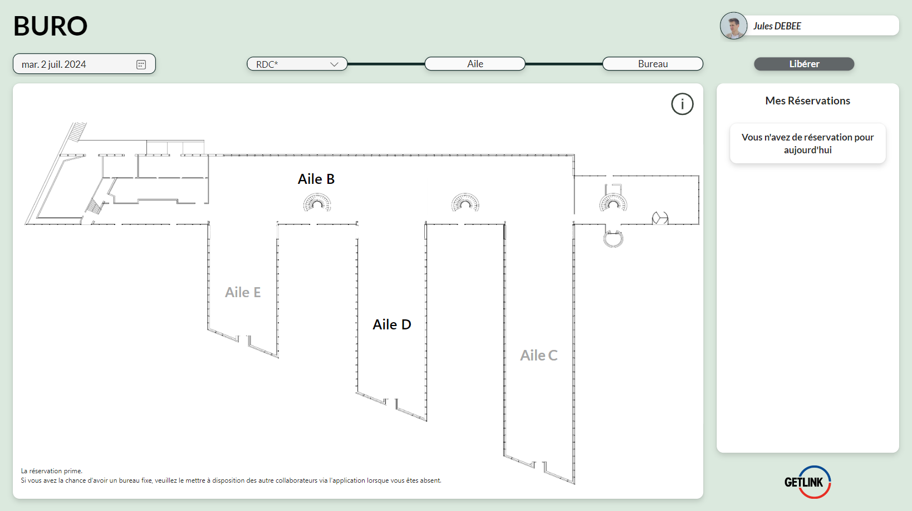
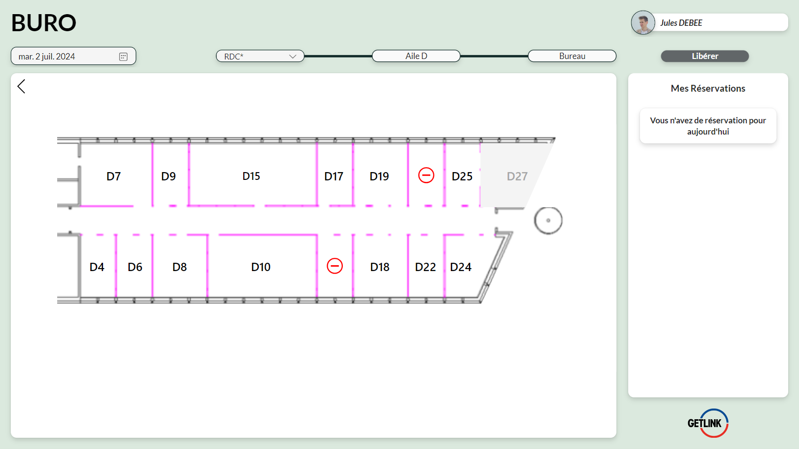
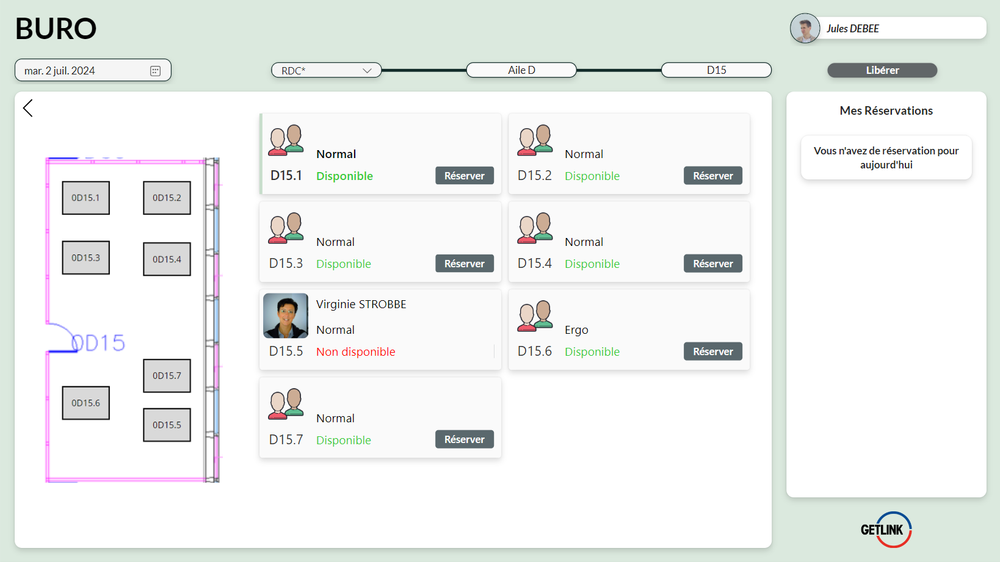

# Introduction
Bienvenue dans la documentation utilisateur de BURO, l'application de réservation d'espaces de travail. Cette documentation vous guidera à travers les fonctionnalités de l'application et vous expliquera comment l'utiliser efficacement.

# 1. Prise en Main de BURO
## 1.1. Ouvrez l'Application
- **Ouvrir** l'application BURO depuis l'application Power Apps.
- **Si vous n'avez pas Accès**, contactez l'équipe informatique.

# 2. Interface de l'Application
À votre arrivée dans l'application BURO, vous verrez le plan global du siège. Vous pouvez choisir, avec le menu déroulant, d'accéder au RDC ou au 1er étage. L'image est découpée en deux : à droite, dans le petit menu, vous avez vos réservations à venir. Pour supprimer une réservation, appuyez sur l'icône de suppression.

## 2.1. Plan d'ensemble du siège
<!--  -->

## 2.2. Réservation d'un Bureau
Pour réserver un bureau, déplacez-vous dans l'image. Cliquez sur l'aile que vous souhaitez réserver, puis sélectionnez le bureau, et enfin, cliquez sur le bouton "Réserver" sur le bureau que vous avez choisi.

<!--  -->

<!-- ### 2.3. Bureau D15
Voici à quoi ressemble le bureau D15.

 -->

# 3. Assistance
## 3.1. FAQ
Consultez notre section FAQ dans l'application pour des réponses aux questions courantes.

## 3.2. Contacter le Support
- Pour toute autre question ou problème, contactez notre équipe de support via l'onglet "Assistance" dans l'application ou par email à support@buroapp.com.

# Conclusion
Merci d'utiliser BURO ! Nous espérons que cette application vous aidera à mieux gérer vos espaces de travail. Pour des suggestions ou des commentaires, n'hésitez pas à nous contacter.
